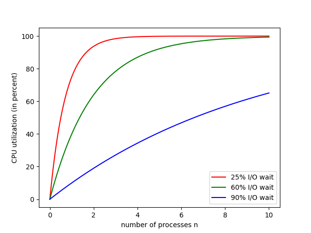

# VE482 Homework 2
#  Weili Shi 519370910011  Oct 11, 2021
## Ex.1 Multiprogramming

1. Probability of n processes waiting at the same time: **$p^n$**

   CPU utilization: $1-p^n$

2. 

3. a). $\lfloor(256-96)\rfloor\div48=3$

   ​     3 processes can be stored.

   b). CPU utilization is $1-0.9^3=27.1\%$

   c).

   - 256 MB: CPU utilization: $57.0\%$ , which is $0.117\%$ per MB added.

   - 512 MB: CPU utilization: $77.1\%$, which is $0.098\%$ per MB added.

   - 1024 MB: CPU utilization: $92.0\%$, which is $0.063\%$ per MB added.

      Therefore, adding  **256 MB** would be the most beneficial.

