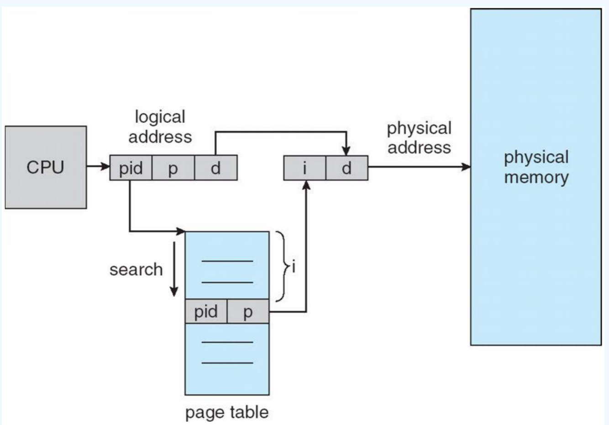
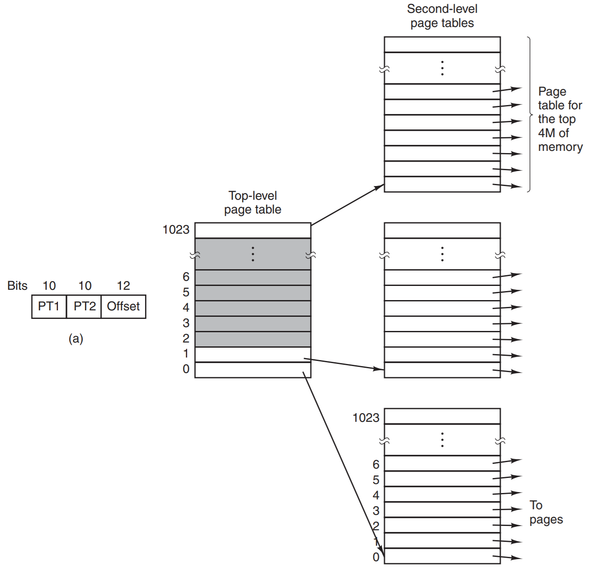
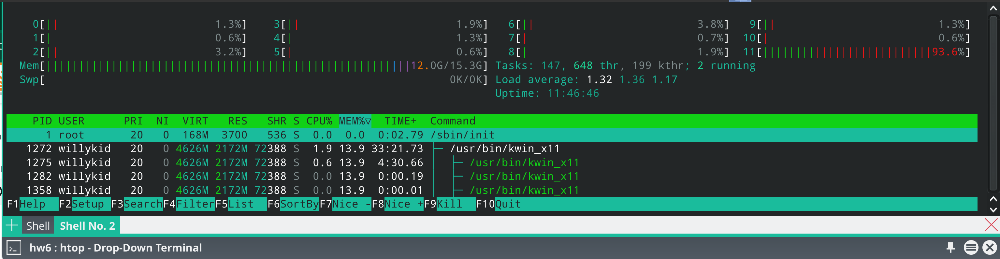
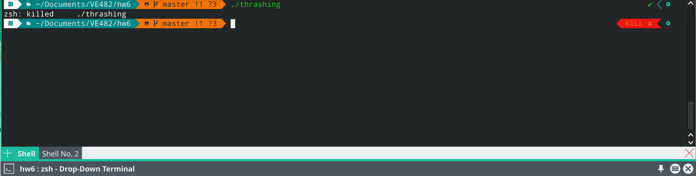

<script>
   $(document).ready(function() {
     $head = $('#header');
     $head.prepend('')
   });
</script>
<div></div>

# VE482 Homework 6
# <span style="font-family:Myriad Pro; font-size:0.6em;"> Weili Shi | 519370910011 | Nov 25, 2021</span>

## Ex 1.

1. **Consider a swapping system in which memory consists of the following hole sizes in memory order: 10 KB, 4 KB, 20 KB, 18 KB, 7 KB, 9 KB, 12 KB, and 15 KB. Assuming first fit is used, which hole is taken for successive segment requests of: (i) 12 KB, (ii) 10 KB and (iii) 9KB. Repeat for best fit and quick fit.**

   - First fit:

       (i) 20 KB

      (ii) 10 KB

     (iii) 18 KB

   - Best fit:

       (i) 12 KB

      (ii) 10 KB

     (iii) 9 KB

   - Quick fit:

       (i) 12 KB

      (ii) 10 KB

     (iii) 9 KB

2. **If an instruction takes 10 nsec and a page fault takes an additional n nsec, give a formula for the effective instruction time if page faults occur every k instructions.**

   (10 + n / k) nsec

3. **A small computer has four page frames. At the first clock tick, the R bits are 0111. At t subsequent clock tics, the values are 1011, 1010, 1101, 0010, 1010, 1100 and 0001. Assuming the aging algorithm is used with an 8-bit counter what is the value of the four counters after the last tick.**

- page 0: 01101110
- page 1: 01001001
- page 2: 00110111
- page 3: 10001011

## Ex 2.

**In the lecture it was mentioned that the translation from virtual address into physical address could be sped up using the TLB. Unfortunately this solution is not of much help in the case of large page tables. Investigate the two following alternative solutions: inverted page tables and multilevel page tables.**

- **Inverted page tables**

  The inverted page table keeps track of all physical pages. In this design, there is one entry per page frame in real memory, rather than one entry per page of virtual address space. Although inverted page tables save lots of space, at least when the virtual address space is much larger than the physical memory, they have a serious downside: virtual-to-physical translation becomes much harder. When process n references virtual page p, the hardware can no longer find the physical page by using p as an index into the page table. Instead, it must search the entire inverted page table for an entry (n, p). We can make use of TLB to reduce the number of times that we need to search.

  

- Multilevel page table

  The secret to the multilevel page table method is to avoid keeping all the page tables in memory all the time. In particular, those that are not needed should not be kept around. 

  The page table contains 2 or more levels of page tables. The entries in level 1 points to entries in level 2 and so on. The entries in the last frame contains information of physical frame it points to. TLB can also be used to speed up multilevel page table.

  

## Ex 3. Research

**1. Security Holes**

References: 

- https://en.wikipedia.org/wiki/Security_bug
- https://waverleysoftware.com/blog/top-software-vulnerabilities/

Common security flaws caused by software are:

- Memory safety (buffer overflow/dangling pointers)
- Race condition
- Secure input/output handling
- Faulty use of API
- Improper exception handling

“Buffer overflow” is ranked #1 on the CWE Top 25 2019 list and is most prevalent in C and C++ programming languages. When memory buffer receives more than its capacity, data is written outside the allocated area as the program executes. Read/write operations are conducted outside buffer limits. Here's an example from partial C codes:

```c
char buffer[10];
buffer[10] = 'a';
```

Here's another example:

```C
char *ptr = (char *)malloc(10);
prr[10] = 'a';
```

Here's another:

```C
char buffer[10];
strcpy(buffer, "Too long!! Too long!! Too long!!!!!")
```

**2. Meltdown and Spectre**

- **Meltdown**

  References: 

  - https://en.wikipedia.org/wiki/Meltdown_(security_vulnerability)
  - https://en.wikipedia.org/wiki/Kernel_page-table_isolation
  - https://en.wikipedia.org/wiki/Spectre_(security_vulnerability)#Mechanism
  - http://www.cs.toronto.edu/~arnold/427/19s/427_19S/indepth/sm/Meltdown-and-Spectre.pdf

  Most modern processors use the following techniques to be efficient: virtual memory, privilege levels (a means for the OS to control which processes are authorized to read which area of virtual memory). The meltdown occurs in the following sequence:

  1. The CPU encounters an instruction accessing the value, A, at an address forbidden to the process by the virtual memory system and the privilege check. Both privilege check and memory access check are scheduled.
  2. The CPU encounters an instruction accessing address Base+A, with Base chosen by the attacker.
  3. The privilege check informs the execution unit that the address of the value, A, involved in the access is forbidden to the process => instruction should fail. However, it was presumed to have been executed, and Base+A loaded in cache already (before the privilege check). => Meltdown intervenes.
  4. Program executes a "timing attack" by executing instructions referencing memory operands directly. To be effective, the operands of these instructions must be at addresses which cover the possible address, Base+A, of the rejected instruction's operand. Since Base+A already cached, the instruction that references memory operand directly executes faster. The timing difference can be detected, base+A calculated, A is determined!

  Fix: kernel page-table isolation, which isolates user space and kernel space memory, by entirely separating user-space and kernel-space page tables entirely (two copies of page tables, the one in user space contains minimal kernel pages).

  

- **Spectre**

  While Meltdown can be used to read privileged memory in a process's address space, Spectre can be used to manipulate a process into revealing its own data. 

  There are many variants. For example:

  Variant 1: exploiting conditional branches

  ○ Give branch predictor a certain amount of good values 

  ○ Then give an evil value 

  ○ Predictor will execute the code before the condition has been checked

  Variant 2: targeting branch target buffer

  - Attacker chooses a "gadget" from victim's address space
  - Trains the branch target buffet to mispredict a branch to  the address of gadget

  Fixes include:

  - new CPU instructions that eliminates branch speculation
  - new CPU architecture
  - Isolate kernel and user mode page tables

**3. Dirty COW**

References:

- https://en.wikipedia.org/wiki/Copy-on-write
- https://en.wikipedia.org/wiki/Dirty_COW
- https://www.cs.toronto.edu/~arnold/427/18s/427_18S/indepth/dirty-cow/index.html

Copy on write: 

If a resource is duplicated but not modified, it is not necessary to create a new resource; the resource can be shared between the copy and the original. Therefore, copy operation is deferred until the first write.

Dirty Cow:

First, we create a private copy (mapping) of a read-only file. Second, we write to the private copy. Since it's our first time writing to the private copy, the COW feature takes place. **The problem** lies in the fact that this write consists of **two non-atomic actions**:

1. locate physical address
2. write to physical address

This means we can get right in the middle (via another thread) and tell the kernel to throw away our private copy — using madvise. This throwing away of the private copy results in the kernel accidentally writing to the original read-only file.

A visual explanation: 

https://www.cs.toronto.edu/~arnold/427/18s/427_18S/indepth/dirty-cow/demo.html

## Ex 4. Linux

Write a very short C program that leads to thrashing.

See thrashing.c for details.





After running the program, the memory usage increases very quickly, before dropping to around 7 GB when the process is killed.
