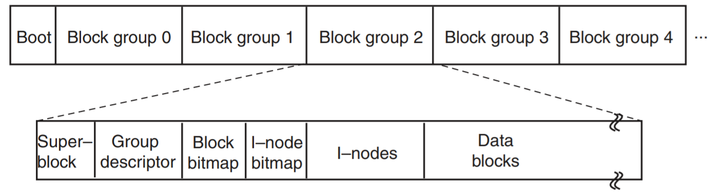
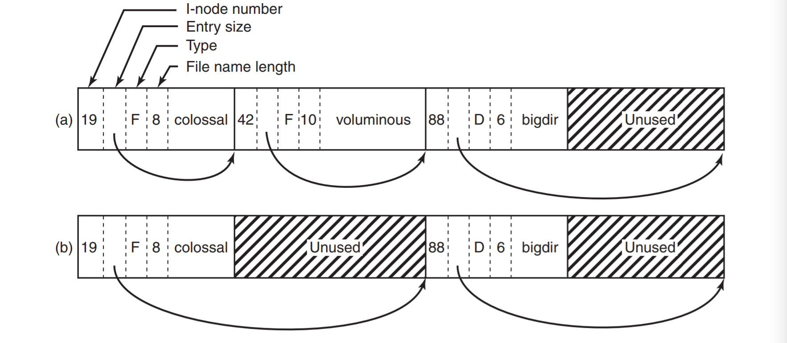

<script>
   $(document).ready(function() {
     $head = $('#header');
     $head.prepend('')
   });
</script>
<div></div>

# VE482 Homework 7
# <span style="font-family:Myriad Pro; font-size:0.6em;"> Weili Shi | 519370910011 | Nov 28, 2021</span>

## Ex. 1 — Page replacement algorithm

1. **Explain the content of the new table entries if a clock interrupt occurs at tick 10.**

   All the R bit will be set to 0. The new system state would be:

   | page | timestamp | present | referenced | modified |
   | :--: | :-------: | :-----: | :--------: | :------: |
   |  0   |     6     |    1    |     0      |    1     |
   |  1   |     9     |    1    |     0      |    0     |
   |  2   |     9     |    1    |     0      |    1     |
   |  3   |     7     |    1    |     0      |    0     |
   |  4   |     4     |    0    |     0      |    0     |

2. **Due to a read request to page 4 a page fault occurs at tick 10. Describe the new table entry.**

   The WSClock algorithm goes through the existing page frames and finds an existing page to replace. 
   
   - Page 0 is dirty, schedule write
   - page 1 is referenced, set referenced to 0
   - page 2 is referenced and dirty, set referenced to 0 and schedule write
   - page 3 is not referenced, and is clean, we replace page 3, set time stamp

| page | timestamp | present | referenced | modified |
| :--: | :-------: | :-----: | :--------: | :------: |
|  0   |     6     |    1    |     0      |    1     |
|  1   |     9     |    1    |     0      |    0     |
|  2   |     9     |    1    |     0      |    1     |
|  3   |    10     |    1    |     0      |    0     |
|  4   |     4     |    0    |     0      |    0     |

## Ex. 2 — Minix3 system call

**1. In which files are:**

1. the constants with number and name for the system calls:

   **/usr/include/minix/callnr.h**

2. the names of the system call routines

   **/usr/src/servers/*/table.c**

   This file contains the table used to map system call numbers onto the

    routines that perform them.

3. the prototypes of the system call routines

   **/usr/src/servers/*/proto.h**

4. the system calls of type "signal"

   **/usr/src/servers/pm/signal.c**

**2. What problems arise when trying to implement a system call int getchpids(int n, pid_t *childpid) which “writes” the pids of up to n children of the current process into *childpid?**

We don't know which is the n'th child. If we have to define a n'th child, the children should be sorted in a specific order.

**3. Write a “sub-system call” int getnchpid(int n, pid_t childpid) which retrieves the n-th child process.**

```C
#include "pm.h"
#include "mproc.h"

int getnchpid(int n, pid_t *childpid) {
    register struct mproc *rmc; // pointer to nth child process
    
    if (childpid == NULL) return -1;
    if (n > NR_PROCS) return -1;
    rmc = &mproc[n];
    if (rmc->mp_parent != who_p) return -1;
    *childpid = rmc->mp_pid;
    
    return OK;
}
```

**4.  Using the previous sub-system call, implement the original getchpids system call. The returned int value corresponds to the number of pids in *childpid, or -1 on an error.**

- We should find an unused entry in the `table.c` file, and add our `do_getchpids` system call to the table.

- Then, we declare the prototype in `proto.h` in the `pm` folder, like this:

  `int do_getchpids(int n, pid_t *childpid);`

- Then, we write our system call:

```C
#include "pm.h"
#include "mproc.h"

int do_getchpids(int n, pid_t *childpid) {
    int index;
    for (index = 0; index < n; index++) {
        if (getnchpid(index, childpid+index) != OK) {
			index = -1;
            break;
        }
    }
    return index;
}
```

- finally we compile our modified pm server

**5. Write a short program that demonstrate the previous system calls.**

```C
// include the necessary headers here
// we fork 10 children, and collect their pids when forking
// then call do_getchpids to see if the results are the same

int main() {
    int n = 10;
    pid_t pid_children[10];
    pid_t pid_result[10];
    for (int i = 0; i < n; i++) {
        pid_t pid_c = fork();
        if (pid_c == 0) {
            sleep(10);
            return 0;
        } else {
            pid_children[i] = pid_c;
        }
    }
   	do_getchpids(n, pid_result);
    for (int i = 0; i < n; i++) {
        printf("The number %d child with pid: %d, 
               do_getchpids returned %d\n", 
               i+1, pid_children[i], pid_result[i]);
    }
    for (int i = 0; i < n; i++) {
        wait(NULL);
    }
    return 0;
}
```

**6. The above strategy solves the initial problem through the introduction of a sub-system call.**

**a). What are the drawbacks and benefits of this solution?**

Drawbacks: function call overhead, lower efficiency, crossing boundary many times

Benefits: the sub-system call is easy to implement. Other system call may want to use the sub-system call if it wants to get the pid of the nth child only.

**b). Can you think of any alternative approach? **

Instead of getting the pid of the nth child, we pass the entire array and return pids of all children.

## Ex 3. Research — `ext2` file system

References: 

- Modern operating systems, 4th edition

- https://www.halolinux.us/kernel-reference/dentry-objects.html
- man inode
- man 2 read

`ext2` is one of the most popular on-disk file systems used in Linux. `ext` stands for extended, which allows for longer file names and larger file sizes (as compared to the first Linux release, which used the MINIX 1 file system).

The file system layout is shown below. The file system is split into blocks, where block 0 is not used by Linux and contains code to boot the computer. After block 0, the blocks are grouped to form block groups.

Within the **block groups**, the first block is called the superblock, which contains information about the layout of the file system, including the number of i-nodes, the number of disk blocks, and the start of the list of free disk blocks. The next blocks are shown below.



**bitmaps** are used to keep track of the free blocks and free i-nodes. They are used to make quick decisions regarding where to allocate new file-system data. When new file blocks are allocated, ext2 also preallocates a number (eight) of additional blocks for that file, so as to minimize the file fragmentation due to future write operations.

**i-node** or the index node, is a data structure that describes a file system object (file, directory...). Here are some information typically found in the file inode, such as inode number, file type and mode, user or group ID, file size, number of blocks allocated to the file, last accessed timestamp, birth time, and so on. The command `stat $FILE_NAME` reads information from inode, for example.

**data blocks** are where all the files and directories are stored. Blocks of large files are likely to be spread all over the disk.

Shown below is an example of a **directory file**. Within a directory, entries for files and directories are in unsorted order. Each **directory entry** consists of 4 fixed-length fields and 1 variable-length field. The first entry is `inode number`, then the second `rec_len`, which is how big the entry is in bytes. `rec_len` is used to find the start of the next entry. The third entry is the `type field`: file, directory and so on. The fourth entry is the length of the file name in bytes. Finally is the file name, terminated by a 0 and additional padding.



Since searching for a directory can be linear, the system maintains a cache of recently accessed directories, where each entry is a dentry object. When a directory entry is read into memory, it is transformed into a **dentry** object. The kernel creates a dentry object for every component of a pathname that a process looks up; the dentry object associates the component to its corresponding inode. When we find the file that we asked for, we use the inode number to access the corresponding entry in the inode table.

**Ex 4. Simple Questions**

**1.  If a page is shared between two processes, is it possible that the page is read-only for one process and read-write for the other? Why or why not?**

No. When a page is shared, if one process writes to it, a copy of the page will be made, then the page will not be shared. Therefore, only read-only pages can be shared.

**2. A computer provides each process with 65,536 bytes of address space divided into pages of 4096 bytes. A particular program has a text size of 32,768 bytes, a data size of 16,386 bytes, and a stack size of 15,870 bytes. Will this program fit in the address space? If the page size were 512 bytes, would it fit?**

- Page of 4096 bytes: No!
  - 65536 / 4096 = 16 pages in total
  - text needs: 32768 / 4096 = 8 pages
  - data needs: 16386 / 4096 = 5 pages
  - stack needs: 15870 / 4096 = 4 pages
  - 8 + 5 + 4 = 17 > 16
- Page of 512 bytes: Yes!
  - 65536 / 512 = 128 pages in total
  - text needs: 32768 / 512 = 64 pages
  - data needs: 16386 / 512 = 33 pages
  - stack needs: 15870 / 512 = 31 pages
  - 63 + 33 + 31 = 128

**3. When both paging and segmentation are being used, first the segment descriptor is found and then the page descriptor. Does the TLB also need a two-levels lookup?**

No. We can directly find the page with the segment number and page number.
