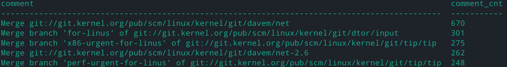

<script>
   $(document).ready(function() {
     $head = $('#header');
     $head.prepend('')
   });
</script>
<div></div>

# VE482 Lab4
# <span style="font-size:0.6em;"> Weili Shi 519370910011  Oct 22, 2021</span>

## 1. Database

### 1.1 Database creation

```shell
git log --pretty="%H|%aN|%aI|%at" > timestamp.csv

git log --pretty="%H|%aN|%s" > db.csv

```

### 1.2 Database system installation

- Most common database systems:
  - Oracle Database, MySQL, Microsoft SLQ Server, MongoDB, PorstgreSQL

- Pros and cons of the three most common ones:
  - Oracle Database:
    - pros: robust, one of the most advanced, offers lots of functionality
    - cons: expensive, the database may require extensive hardware resources
  - MySQL:
    - pros: free of cost, a variety of user interfaces, can work with other databases
    - cons: support is not free, some common features missing
  - Microsoft SQL Server:
    - pros: fast, stable, can adjust performance levels to reduce resource usage
    - cons: expensive, resource-consuming even with performance tuning
- Create an empty SQLite database, prepare empty tables and import the `.csv` files:

```sqlite
sqlite3 l4.db

CREATE TABLE db
(
	hash TEXT NOT NULL,
    name TEXT NOT NULL,
    comment TEXT NOT NULL
);

CREATE TABLE time_stamp
(
	hash TEXT NOT NULL,
    name TEXT NOT NULL,
    dates TEXT,
    tstamps INT
);

.separator "|"
.import db.psv db
.import demo.psv demo
```

### 1.3 Database queries

- **Who are the top five contributors to the Linux kernel since the beginning?**

```sqlite
SELECT name, COUNT(name) as contrib_cnt 
FROM time_stamp 
GROUP BY name 
ORDER BY contrib_cnt DESC 
LIMIT 5;

/* 
OUTPUT:
name             contrib_cnt
---------------  -----------
Linus Torvalds   30702      
David S. Miller  13180      
Takashi Iwai     7726       
Mark Brown       7670       
Arnd Bergmann    7520  
*/
```

- **Who are the top 5 contributors to the Linux kernel each year over the past 5 years?**

```sqlite
-- 2016 --
SELECT name, COUNT(name) as contrib_cnt
FROM time_stamp
WHERE dates BETWEEN '2016-01-01' AND '2016-12-31'
GROUP BY name
ORDER BY contrib_cnt DESC
LIMIT 5;
-- 2017 --
SELECT name, COUNT(name) as contrib_cnt
FROM time_stamp
WHERE dates BETWEEN '2017-01-01' AND '2017-12-31'
GROUP BY name
ORDER BY contrib_cnt DESC
LIMIT 5;
-- 2018 --
SELECT name, COUNT(name) as contrib_cnt
FROM time_stamp
WHERE dates BETWEEN '2018-01-01' AND '2018-12-31'
GROUP BY name
ORDER BY contrib_cnt DESC
LIMIT 5;
-- 2019 --
SELECT name, COUNT(name) as contrib_cnt
FROM time_stamp
WHERE dates BETWEEN '2019-01-01' AND '2019-12-31'
GROUP BY name
ORDER BY contrib_cnt DESC
LIMIT 5;
-- 2020 --
SELECT name, COUNT(name) as contrib_cnt
FROM time_stamp
WHERE dates BETWEEN '2020-01-01' AND '2020-12-31'
GROUP BY name
ORDER BY contrib_cnt DESC
LIMIT 5;
```

Output:

```sqlite
/*
2016:
name                   contrib_cnt
---------------------  -----------
Linus Torvalds         2273       
Arnd Bergmann          1185       
David S. Miller        1150       
Chris Wilson           988        
Mauro Carvalho Chehab  975   

2017:
name             contrib_cnt
---------------  -----------
Linus Torvalds   2288       
David S. Miller  1420       
Arnd Bergmann    1123       
Chris Wilson     1028       
Arvind Yadav     827      

2018:
name               contrib_cnt
-----------------  -----------
Linus Torvalds     2163       
David S. Miller    1405       
Arnd Bergmann      919        
Christoph Hellwig  818        
Colin Ian King     798   

2019: 
name               contrib_cnt
-----------------  -----------
Linus Torvalds     2380       
David S. Miller    1205       
Chris Wilson       1170       
YueHaibing         929        
Christoph Hellwig  911  

2020:
name                   contrib_cnt
---------------------  -----------
Linus Torvalds         1886       
David S. Miller        923        
Christoph Hellwig      806        
Mauro Carvalho Chehab  770        
Chris Wilson           644  
*/
```

- **What is the most common “commit subject”?**

```sqlite
SELECT COUNT(comment) AS comment_cnt 
FROM db 
GROUP BY comment 
ORDER BY comment_cnt DESC 
LIMIT 5;
```

Result:



```sqlite
/*
Most common commit subject:
Merge git://git.kernel.org/pub/scm/linux/kernel/git/davem/net
*/
```

- **On which day is the number of commits highest?**

```sqlite
SELECT DATE(dates), COUNT(dates) as commit_cnt 
FROM time_stamp 
GROUP BY DATE(dates) 
ORDER BY commit_cnt DESC 
LIMIT 5;
```

Result:

```sqlite
/*
2008-01-30 is the day with highest number of commits.

DATE(dates)  commit_cnt
-----------  ----------
2008-01-30   1031      
2006-12-07   683       
2007-05-08   649       
2013-07-03   626       
2007-10-16   613    
*/
```

- **Determine the average time between two commits for the five main contributor.**

```sqlite
SELECT name, (MAX(tstamp) - MIN(tstamp)) / (COUNT(name) - 1) AS interval 
FROM time_stamp 
WHERE name = "Linus Torvalds";

SELECT name, (MAX(tstamp) - MIN(tstamp)) / (COUNT(name) - 1) AS interval 
FROM time_stamp 
WHERE name = "David S. Miller";

SELECT name, (MAX(tstamp) - MIN(tstamp)) / (COUNT(name) - 1) AS interval 
FROM time_stamp 
WHERE name = "Takashi Iwai";

SELECT name, (MAX(tstamp) - MIN(tstamp)) / (COUNT(name) - 1) AS interval 
FROM time_stamp 
WHERE name = "Mark Brown";

SELECT name, (MAX(tstamp) - MIN(tstamp)) / (COUNT(name) - 1) AS interval 
FROM time_stamp 
WHERE name = "Arnd Bergmann";
```

Results:

```sqlite
/*
name            interval
--------------  --------
Linus Torvalds  15880 

name             interval
---------------  --------
David S. Miller  36956  

name          interval
------------  --------
Takashi Iwai  63301   

name        interval
----------  --------
Mark Brown  59933   

name           interval
-------------  --------
Arnd Bergmann  63807   
*/
```

## 2. Debugging

- **How to enable built-in debugging in `gcc`?**

  Add the option `-g`

- **What is the meaning of `GDB`?**

  GDB: the GNU project debugger. It can:

  - Execute the program
  - Stop the program on specified conditions
  - Examine why it stopped
  - Change the program to detect bugs

- **Compile the master branch of you `mumsh` with debugging enabled.**

  Add the flag `-g` to `CFLAGS`, for example

  ```makefile
  CFLAGS = -std=gnu11 -O2 -Wall -Wextra -Werror -pedantic -Wno-unused-result -g
  ```

  Then, `make all`

### 2.1 Basic GDB usage

- **Homapage of GDB project:**

  - https://www.gnu.org/software/gdb/

- **What languages are supported by GDB?**

  - Ada
  - Assembly
  - C
  - C++
  - D
  - Fortran
  - Go
  - Objective-C
  - OpenCL
  - Modula-2
  - Pascal
  - Rust

- **What are thr following GDB commands doing**

  - `backtrace`: print a backtrace of the entire stack, starting with the currently executing trace, followed by its caller and on up the stack.
  - `where`: exactly the same as `backtrace`
  - `finish`: continue running in the current frame until it returns
  - `delete`: delete a specific or all breakpoints
  - `info breakpoints`: info of existing break points and watch points

- **Conditional breakpoints**

  - `condition <breakpoint_number> expression`, where we can specify `expression`, such as `i < 100` 

- **What is `-tui` option for GDB?**

  - `-tui`: "text user interface", short cut: `CTRL-XA`

- **What is the “reverse step” in GDB and how to enable it.**

  1. set two breakpoints 2, 3

  2. set the rule when we hit break points 2 and 3

     ```shell
     command 3 run end
     # rerun the program when hitting break point 3
     command 2 record continue end
     # enable record when hitting break point 
     ```

  3. Disable pagination for tidiness: `set pagination off`
  4. Rerun and when error occurs, the program will stop
  5. Reverse one instruction and we are back: `reverse-stepi`

