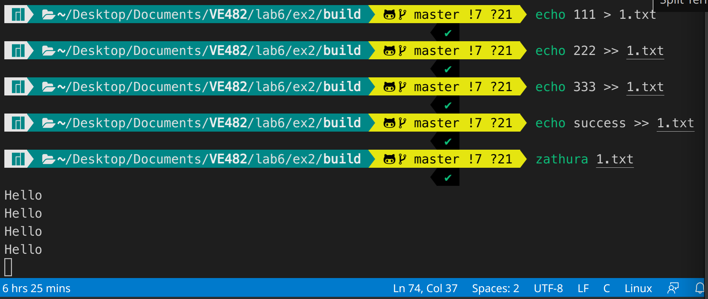
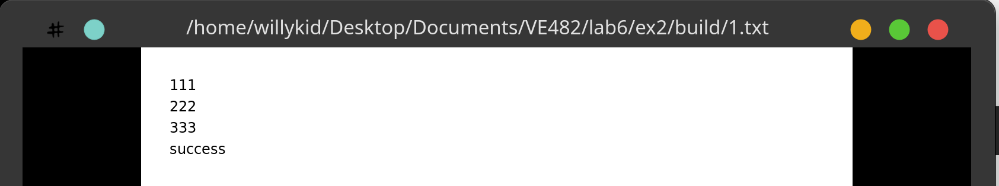

<script>
   $(document).ready(function() {
     $head = $('#header');
     $head.prepend('')
   });
</script>
<div></div>

# VE482 Lab6
# <span style="font-size:0.6em;"> Weili Shi 519370910011  Nov 4, 2021</span>

## 1. Plugin based  software development

## 2. Zathura plugin-txt

To learn more about the txt plugin, see `./ex2/README.md`.

To install zathura

```shell
yay -S zathura
```

To build the plugin

```shell
meson build
cd build
ninja
ninja install
```


To test the plugin

```shell
zathura $(txt_file_name)
```

Test result:

Each time zathura reads a line, it prints "Hello" to stdout.


The text file is correctly displayed.



## 3. Design a plugin architecture

- `plugin-manager.h`: maintains a linked list that stores registered plugins
  - ```c#
    typedef int (*hook_t)(char *argv[]);
    
    typedef struct _Manager {
      Handle *first;
    } Manager;
    
    typedef struct _Handle {
      hook_t hook; // function that gets the job done
      char type[32]; // name of the file type (txt or csv)
      Handle *next;
    } Handle;
    
    ```
  
  - explanation: 
  
    - `Manager` is a linked list structure that stores the first node to `Handle`.
    - `Handle` is used for the plugin to store its information.
    - The main function looks for `.so` plugin file in the `./plugins` directory. If found, the main function obtains a "handle", or the address of the function "init_plugin", through which the plugin registers itself by adding a node "Handle" to the Manager of main.
    - The "hook" is a function pointer that gets the job done. In this case, the "hook" function is "ui_cmd" that reads the file and sorts it. 
  
- The code can handle 2 file types: txt or csv. To learn more, see `./ex3/README.md`.

